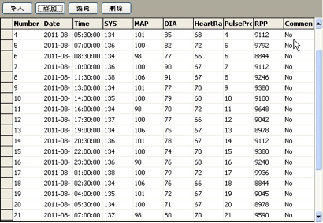
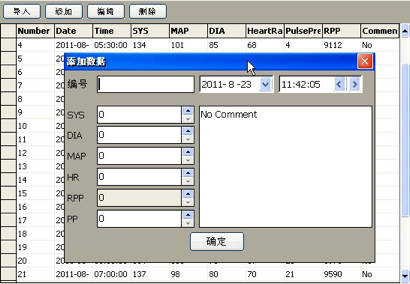
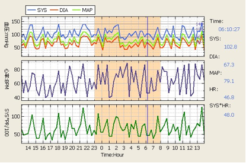
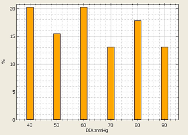
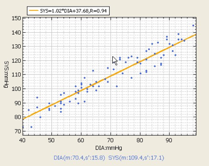
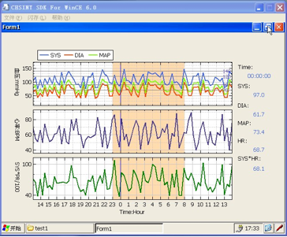
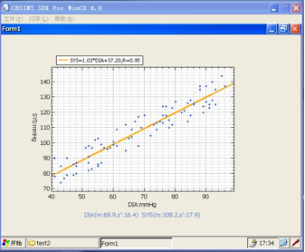
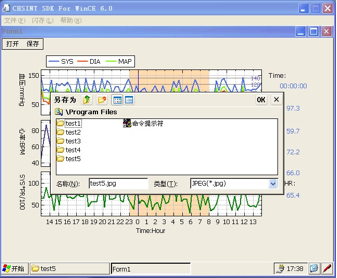

ChartProject
============
修改Nplot组件

##ChartDataView 数据表格
可以导入数据（支持txt和excel）、添加数据、编辑数据、删除数据。（代码中有详细注释）

##TendencyChart 趋势图

##FrequencyChart 频率图

包含四种：SYS,DIA,MAP,HR，间距设为10。

##AnalysisChart 统计图
包含四种DIA_SYS,PULSE_SYS,PULSE_DIA,PULSE_MAP，内容包括：回归直线、相关系数、均值和方差。Statistics类，用于回归直线和相关系数的计算。

##Test项目
用于测试各种图表和数据的加载、存储，共六个测试项目

